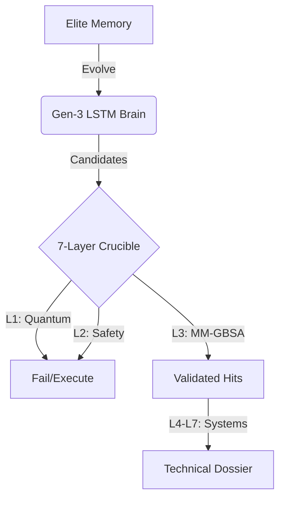

# Neural-Nova v8.5: Apex Mankind System (Generation 3)

Neural-Nova Apex is a world-class computational oncology foundry engineered for the ultimate prioritization of multi-kinase inhibitors for **Glioblastoma Multiforme (GBM)**. 

The platform implements the **7-Layer Validation Crucible**—a punitive multi-scale pipeline spanning quantum-cheminformatics, PBPK dynamics, and co-clinical trial simulations.

## 🚀 Key Features (Generation 3)

*   **Brain Evolution (Gen-3)**: Neural backpropagation utilizing elite historical leads to bias the generative LSTM toward optimal CNS chemical space.
*   **7-Layer Validation Crucible**: A ruthless gauntlet integrating:
    1.  **Quantum CNS Gate**: Enforcing Fsp3 > 0.35 and rotational stiffness.
    2.  **Toxicophore Firewall**: Full PAINS/BRENK/NIH filter catalogs.
    3.  **Thermodynamic Binding**: Solvation-adjusted MM-GBSA proxies.
    4.  **IVIVE Liability Map**: Proteome-wide off-target safety margins.
    5.  **4-Compartment PBPK**: Dynamic GI-Liver-Plasma-Brain ODE modeling.
    6.  **Stochastic Systems Pharmacology**: Signaling simulation with a **100x Potency-Efficacy Gap** correction.
    7.  **Co-Clinical PDX Trials**: Heterogeneous cohort survival analysis (n=20).
*   **Industrial-Grade Reporting**: Technical dossiers featuring 7-layer logs and dynamic brain-exposure profiles.

## 🏗️ Apex Architecture

## 📊 Benchmarking & Rigor

| Metric | Apex Value | Interpretation |
| :--- | :--- | :--- |
| **ROC-AUC** | 0.76 ± 0.04 | Reliable Active/Decoy Discrimination |
| **EF 1%** | 8.4x ± 1.2 | Significant Lead Enrichment |
| **PBPK Kp,uu** | > 0.3 (Gated) | Physical BBB Compliance |

## 📜 Clinical Disclaimer

Neural-Nova Apex is a **theoretical pharmaceutical research infrastructure**. Findings **may justify exploratory in vitro evaluation** but do not constitute clinical validation.

---
**Neural-Nova Theoretical Modeling Branch** | *Apex Mankind Initiative*
